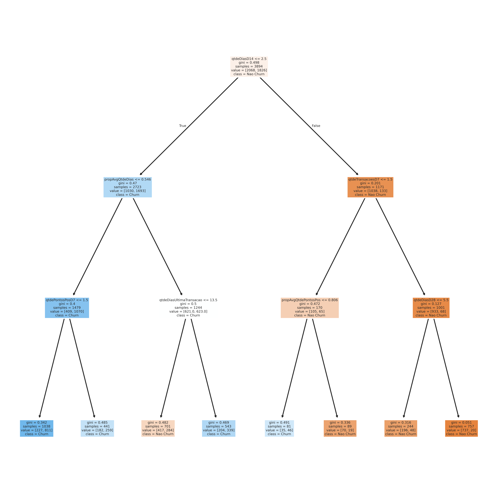
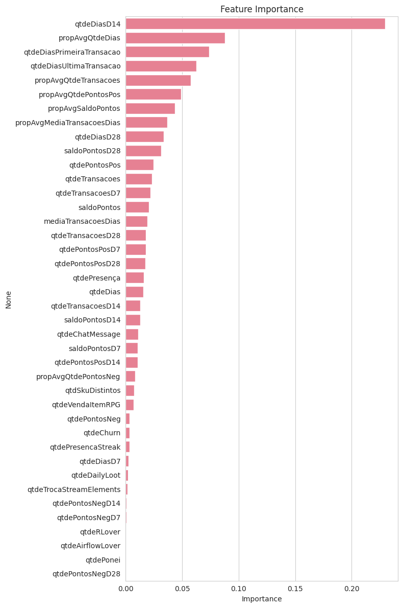
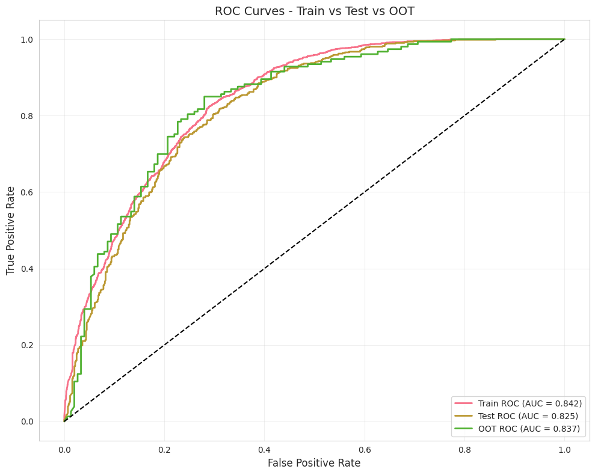
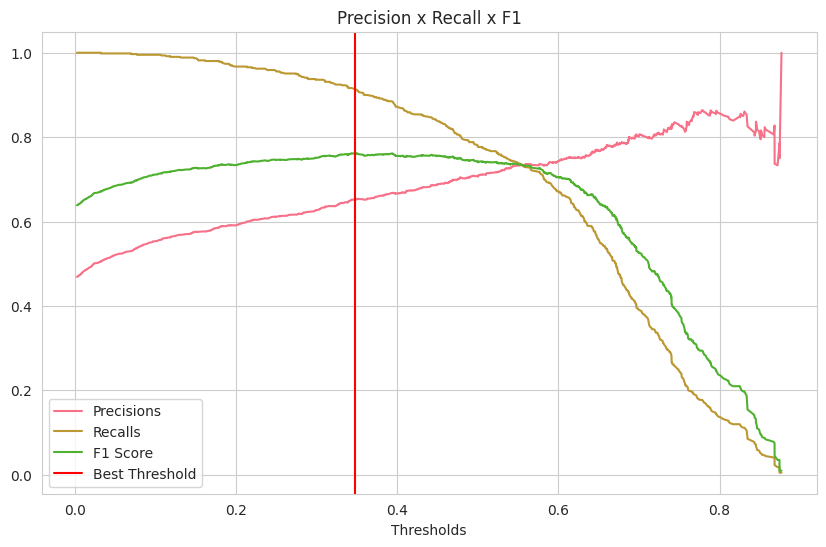
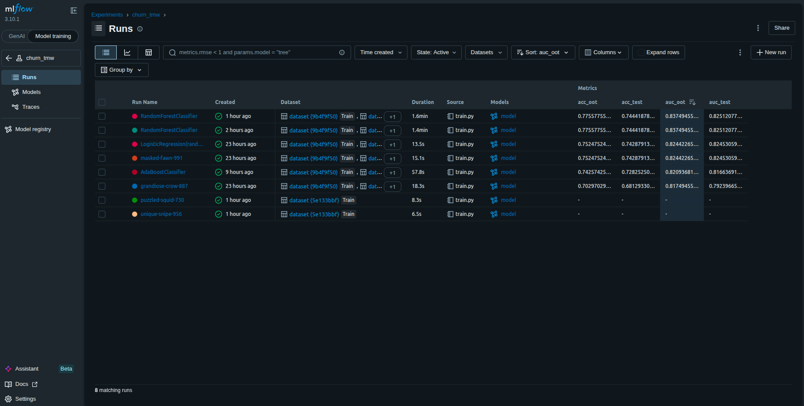

# Churn Prediction — Binary Classification Pipeline

Projeto de modelagem preditiva para detecção de churn com pipeline, rastreamento de experimentos e modelos via MLflow e separação temporal da base de validação (OOT).

---

## Metodologia: SEMMA

O projeto segue a metodologia **SEMMA** (SAS Institute):

| Etapa | O que foi feito |
|---|---|
| **Sample** | Separação temporal em treino/teste/OOT pela coluna `dtRef` |
| **Explore** | Curvas de distribuição por classe, Análise Bivariada (média e razão por var. alvo) |
| **Modify** | Discretização  e Encoding |
| **Model** | Random forest com busca de hiperparâmetros via GridSearchCV |
| **Assess** | AUC-ROC em treino, teste e OOT; curva Precision-Recall; F1-score com threshold ótimo |

---

## Dados

Os dados utilizados são uma ABT pública disponibilizada no Kaggle, contendo variáveis agregadas por usuários para predição de churn de usuários de uma live no Telegram.

- **Fonte**: [ABT Churn: Kaggle](https://www.kaggle.com/datasets/teocalvo/analytical-base-table-churn)

---

## Divisão das Bases

A separação foi feita em **três conjuntos distintos**:

- **Treino + Teste**: Safras históricas; split estratificado (75/25) garantindo a mesma taxa de churn em ambas as partições (stratify=y).
- **OOT (Out-of-Time)**: Safra mais recente (dtRef máximo), isolada **antes** de qualquer modelagem, assim como os dados de teste. Simula o comportamento do modelo em produção em um período não visto durante o treinamento, sendo o principal indicador de generalização temporal.

---

## Seleção de Features

Feature importance extraída de uma Árvore de Decisão. As features foram rankeadas e selecionadas com base na importância acumulada até 95%, eliminando variáveis com baixo poder preditivo (pouca contribuição na soma acumulada) e reduzindo dimensionalidade.

---

## Pipeline de Modelagem

O pipeline encapsula todas as etapas de pré-processamento e modelagem em sequência, garantindo ausência de **data leakage** entre treino e validação.

| Etapa | Classe | Função |
|---|---|---|
| `DecisionTreeDiscretiser` | `feature_engine` | Transforma variáveis contínuas em bins supervisionados via árvore de decisão (cv=3) |
| `OneHotEncoder` | `feature_engine` | Codifica os bins em variáveis dummy |
| `GridSearchCV` | `sklearn` | Busca exaustiva no espaço paramétrico com validação cruzada (cv=3, scoring=roc_auc) |

## Avaliação do Modelo

### Curvas ROC — Treino / Teste / OOT

### Threshold Ótimo

O threshold de classificação foi otimizado via curva **Precision-Recall**, maximizando o F1-score no conjunto de teste. O modelo final é avaliado no OOT com esse threshold aplicado.

---

## Rastreamento de Experimentos — MLflow

Todos as execuções são rastreadas, registrando automaticamente parâmetros, métricas e artefatos do modelo.

**Métricas logadas:**

| Métrica | Descrição |
|---|---|
| `auc_train` | AUC-ROC no conjunto de treino |
| `auc_test` | AUC-ROC no conjunto de teste |
| `auc_oot` | AUC-ROC no OOT |
| `acc_train/test/oot` | Acurácia em cada partição |

